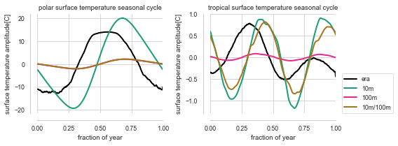
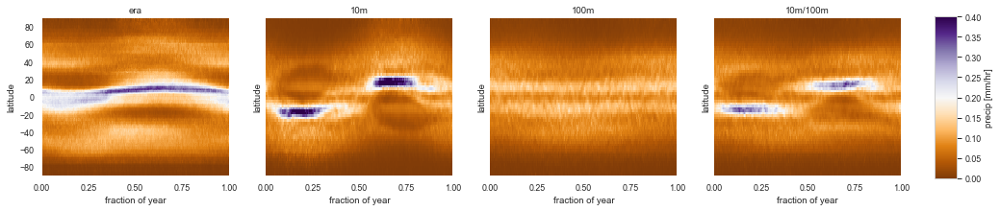
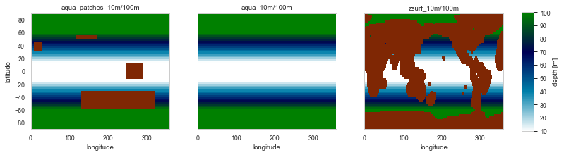

*Iceberg, DOI: X, DATE*

# THE SURFACE OF AN AQUAPLANET GCM

###### Martin jucker
ARC Centre of Excellence for Climate Extremes and Climate Change Research Centre, University of New South Wales, Sydney, Australia

Reviewed by

# Abstract
This article describes some of the challenges and culprits of working with a mixed layer ocean and trying to arrive at an acceptable climatology with a minimum number of parameters.
We discuss why even the simplest version of the Model of an idealized Moist Atmosphere [MiMA](https://github.com/mjucker/MiMA) [[Jucker and Gerber (2017)](http://journals.ametsoc.org/doi/10.1175/JCLI-D-17-0127.1)] includes meridional heat flux ("Q-flux"), a meridionally inhomogeneous mixed layer depth, options to reduce the mixed layer depth locally ("land"), as well as options to change surface albedo.

This work is licensed under a [Creative Commons Attribution 4.0 International License](http://creativecommons.org/licenses/by/4.0/).

##### Keywords
climate science, general circulation models, mixed layer ocean, slab ocean

# Introduction

Studying the effects of the stratosphere and its coupling to the troposphere in idealised general circulation models (GCMs) has traditionally been restricted to dry models, where the temperature is simply forced to a prescribed relaxation temperature profile (e.g. [Held and Suarez (1994)](http://journals.ametsoc.org/doi/abs/10.1175/1520-0477(1994)075%3C1825:APFTIO%3E2.0.CO;2), [Polvani and Kushner (2002)](http://www.agu.org/pubs/crossref/2002/2001GL014284.shtml), [Jucker _et al._ (2013)](http://journals.ametsoc.org/doi/abs/10.1175/JAS-D-12-0305.1)). Although idealised moist models have existed for some time in the form of gray radiation models (e.g. [Frierson _et al._ (2006)](http://journals.ametsoc.org/doi/abs/10.1175/JAS3753.1), or [O'Gorman and Schneider (2008)](https://doi.org/10.1175/2007JCLI2065.1)), the stratosphere adds some complexity in terms of vertical and meridional structures which are non-trivial to add to such models.

There was an obvious gap to close in the model hierarchy between the gray radation schemes and full GCMs, which required the inclusion of the radiative effects of stratospheric ozone. Therefore, Ed Gerber and I decided to build the Model of an idealized Moist Atmosphere (MiMA), which represents one step up from the Frierson gray radation model [[Frierson _et al._ (2006)](http://journals.ametsoc.org/doi/abs/10.1175/JAS3753.1), [Frierson _et al._ (2007)](http://journals.ametsoc.org/doi/abs/10.1175/JAS3935.1)] by replacing the gray radiation with the full radiative transfer code RRTM (Rapid Radiative transfer Model, [RRTM, Mlawer _et al._ (1997)](http://doi.wiley.com/10.1029/97JD00237)). A short introductory movie for MiMA can be found in Fig. 1.

Figure 1: A 30-second introduction to the Model of an idealized Moist Atmosphere (link to YouTube).

Naively, this means simply starting from Frierson's model and exchanging the call to radiation. Everything else could be left as is, as the model has been used very successfully for many studies involving moist dynamics.

In particular, the existing moist model had a boundary layer scheme based on Monin-Obukhov similarity theory, a simplified Betts-Miller convection scheme as well as a mixed layer ocean where shortwave solar radiation gets absorbed and re-emitted in the longwave. All of these simplified parameterisations of real processes have been carefully built, tuned and tested by the original authors, and it was not our intent to modify them.

# Mixed layer ocean

As might be expected with a model which explicitly solves the full radiative transfer including the shortwave, the role of the mixed layer is rather important: Instead of simply acting as lower boundary for the dynamic atmosphere (plus source of water vapor), it has to properly absorb incoming shortwave radiation, convert the absorbed energy into surface temperature, and then re-radiate in the longwave according to its temperature. As a result, the parameter settings which worked for the gray radiation scheme might not work in MiMA.
Indeed, it soon turned out that by far most of the development time of MiMA went into the mixed layer rather than the new radiation scheme.

## The seasonal cycle

[Frierson _et al._ (2006)](http://journals.ametsoc.org/doi/abs/10.1175/JAS3753.1) use a mixed layer depth of 10m. If MiMA is run with the same depth, and setting the radiation to Earth's astronomical parameters (obliquity, solar constant, rotation rate, radius), the poles will heat a lot during summer and cool a lot during winter (Fig. 2, solid blue line). In some cases, this can cause the simulation to fail as the moist dynamics cannot deal with the much too low temperatures over the winter pole.

Figure 2: polar (70-90&deg;N) and tropical (15&deg;S-15&deg;N) temperature timeseries at different mixed layer depths.

Thus, the mixed layer should be increased at least until the poles do not cause the simulation to fail. For realistic polar temperatures in both winter and summer it should be increased even more. There is a trade-off between robustness of the model (i.e. most parameters can be changed and the model still runs smoothly) and realism as compared to e.g. ERA-Interim reanalysis.
The effects of the mixed layer depth on the seasonal cycle and climatology of aquaplanet models has been investigated in detail in [Donohoe _et al._ (2014)](http://link.springer.com/10.1007/s00382-013-1843-4). And just like those authors, we find that the seasonal cycle amplitude depends critically on the mixed layer depth. And it always lags shortwave insolation by at least two months.
Our emphasis is on stability more than realism, and we found a value of about 100 meters to be about right. Note that with this setting, the seasonal cycle over the poles has a much lower amplitude than observed, but this also reduces the effects of the time lag between the model and observations (compare black solid line to blue and green solid lines in Fig. 2).

Thus, the mixed layer should be increased at least until the poles do not cause the simulation to fail. For realistic polar temperatures in both winter and summer it should be increased even more. There is a trade-off between robustness of the model (i.e. most parameters can be changed and the model still runs smoothly) and realism as compared to e.g. ERA-Interim reanalysis. Our emphasis is on stability more than realism, and we found a value of about 100 meters to be about right. Note that with this setting, the seasonal cycle over the poles has a much lower amplitude than observed. On the other hand, there is a clear lag of two to three months between the observed and modelled seasonal cycles in temperature at high latitudes (solid lines in Fig. 2). Part of this is due to the definition of equinox, which is an input parameter, by default set to day 90 for a 360-day year. But most of it is due to the simplicity of the mixed layer as set up here (again, recall that we want it to be as simple as possible). Setting the mixed layer depth to deeper values decreases the amplitude of the seasonal cycle (as described above), and therefore also reduces the dynamical effects of the time lag between the model and observations (compare black solid line to blue and green solid lines in Fig. 2).

With such a deep mixed layer, the model starts being very stable. Unfortunately, (also as described by [Donohoe _et al._ (2014)](http://link.springer.com/10.1007/s00382-013-1843-4)), it causes the tropics to be too stable: The InterTropical Convergence Zone (ITCZ) does not show any real seasonal cycle anymore but simply sticks to the equator (Figs. 2 and 3). The little that it does move is lagged by about three months with respect to the solar forcing, such that such important things as the tropical monsoons around the globe are delayed by weeks to months (Fig. 2, dashed lines).

Therefore, depending on which phenomena are important for a given research project, the mixed layer should either be deep or shallow. The most realistic cases are obtained if the mixed layer is shallow in the tropics (10-20m), and deep at the poles (50-100m). Therefore, the heat capacity of the mixed layer can be adjusted to be constant or to have different values in the tropics and the poles, with a linear transition region in-between (Fig. 3).

Figure 3: With a meridionally varying mixed layer depth (right most panel), the ITCZ can move and follow peak solar input more freely, while the poles do not become too cold nor too warm.

Here again, there are trade-offs to consider. For instance, shallow tropics allow a greater movement of the ITCZ over the year, but it also results in a much broader region of intense precipitation in latitude (Fig. 3, panel 2). Including a gradient to deeper mixed layer at high latitudes (panel 4) restricts that meridional extension of the ITCZ.

## Effect of land

MiMA has the option of adding "land" in the sense of reduced mixed layer depth (the heat capacity of rock is about one thousand times lower than that of water). As a zeroth order approximation, land therefore is still an infinite source of water vapour to the atmosphere. This can either be in the form of an external file (containing a a land-sea mask as is often used in comprehensive models), slaving it to surface topography (by setting an altitude threshold above which any grid point is considered land), or by adding arbitrary rectangles or patches of land (Fig. 4). Then, one can define a different heat capacity for any grid points considered land. As a consequence, whenever adding land, the zonal mean heat capacity is lowered, and the effect of this new mixed layer depth distribution should first be tested before conducting research with the chosen setup. For instance, using a realistic land mask will add the Antarctic continent at the South Pole, which, depending on the setup, might cause problems at high southern latitudes because the South Pole now suddenly has a very low heat capacity (see above discussion).

Figure 4: Different land configurations in MiMA. One can add rectangular "patches" of land (left), no land at all (middle), or let the land mask be a function of orography height (right). It is also possible to provide an input file with a land mask.

## Ocean heat transport

As a consequence of neglecting any ocean dynamics is that the incoming solar energy is not transported to the poles as efficiently as often desired (note that the ocean dominates global meridional heat transport in the tropics [Fasullo and Trenberth (2008)](https://doi.org/10.1175/2007JCLI1936.1)). As a result, the ITCZ is very narrow and the tropical-extratropical temperature contrast is rather high. Therefore, as described by [Merlis _et al._ (2013)](http://journals.ametsoc.org/doi/abs/10.1175/JCLI-D-11-00716.1), a meridional heat flux ("Q-flux") has to be introduced manually. In MiMA, this is done with a simple exponential and zonally symmetric profile following the above paper, and in the cousin model framework [Isca](https://execlim.github.com/Isca), either an external file can be read or a sophisticated algorithm deployed to adjust the heat flux such that the sea surface temperature (SST) matches a reference state [Vallis _et al._ (2018)](https://www.geosci-model-dev.net/11/843/2018/).

One thing to keep in mind here is that the simple default Q-flux is zonally symmetric, and is also active over any regions considered "land" as defined above. Thus, if one strives for realism in the simulated climate and uses real topography and land-sea mask, one might also think about either not using any Q-flux at all or providing an input file with more a sophisticated structure. The upcoming version 2.0 of MiMA has seen some development in that direction and includes more realistic Q-fluxes which are zero over (realistic) land.

Figure 5: Default meridional ocean heat transport. Meridional width and amplitude are runtime input parameters.

## Albedo

Another _a priori_ missing component of MiMA is sea ice and snow cover. This is not a major shortcoming since ocean dynamics, biogeochemistry and others are willingly left out as well to keep the model simple. The main effect of ice and snow on atmospheric dynamics is arguably the albedo effect. Luckily, the albedo can be adjusted rather easily to account for ice, at least in a static sense. Fig. 6 shows examples of adding higher albedo south of 65&deg;S to mimic the effect of Antarctica (yellow line) and different implemented choices for meridional albedo profiles.

Figure 6: Illustration of different meridional albedo profiles in MiMA.

# Conclusions

The Model of an idealized Moist Atmosphere (MiMA) [[Jucker and Gerber (2017)](http://journals.ametsoc.org/doi/10.1175/JCLI-D-17-0127.1), [mjucker.github.io/MiMA](http://mjucker.github.io/MiMA)] is a medium-complexity atmospheric circulation model which was purposefully built to be as simple as possible while still realistically simulating the effects of moisture (except clouds) and stratospheric dynamics. The lower boundary condition is a mixed layer ocean, which is the simplest surface for such a model. No ocean dynamics is included. During the development of MiMA, most of the coding, testing, and decision making was related to the mixed layer ocean, even though it is "only" a boundary condition and does not receive much attention when describing the model. However, many aspects of the simulated climate depend on the exact setup of the mixed layer, and most of the knowledge in how to properly set up this lower boundary is unpublishable personal expertise. This is true of any atmospheric model set up with a mixed layer ocean as lower boundary condition. As a result, the author estimates that most new users are bound to encounter the same difficult decisions and pitfalls as the users before them.

This paper shows some of the effects of the most important parameters using MiMA as example: For every new setup, care has to be taken to the choice of mixed layer depth and its two-dimensional distribution, ocean heat flux parameterisations, albedo, and the definition and distribution of land.

Note that the default setup for MiMA (at least version 1) is constant mixed layer depth. This is to make it as simple as possible, not to make  it as realistic as possible. This will be amended for version 2.0 of MiMA.

# Acknowledgments

The author acknowledges the support by the ARC Centre of Excellence for Climate Extremes under grant CE170100023 and ARC grant FL150100035.
ERA-Interim data obtained from http://apps.ecmwf.int/datasets/data/interim_full_daily/ on 16/07/2015. It was converted to netcdf and made available to the author by ARCCSS ARC Centre of Excellence for Climate System Science www.climatescience.org.au.

*Iceberg, DOI: X, DATE*

---

# Comments
